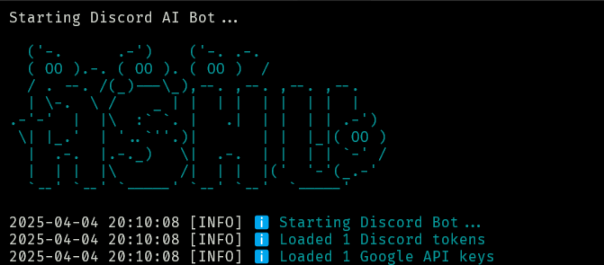

# <div align="center">🤖 Discord AI Bot</div>

<div align="center">
  
  
  
  
  
  
  
</div>

<div align="center">
  
</div>

## 📝 Description

**Discord AI Bot** is a powerful, AI-powered Discord bot that helps server owners boost engagement and activity levels through intelligent automated conversations. Using Google's Gemini AI, this bot provides natural, context-aware responses that make your Discord server feel more active and engaging.

### 🚀 Key Features

- **AI-Powered Conversations**: Natural, context-aware responses using Google's Gemini AI
- **Multi-Channel Support**: Monitor and respond in multiple channels simultaneously
- **Customizable Settings**: Adjust AI behavior, response timing, and message settings
- **Activity Tracking**: Keep logs of all bot activities and conversations
- **Level Boosting**: Increase server activity levels with consistent, engaging conversations
- **Easy Setup**: One-click installation with auto-configuration scripts

### 💬 How It Helps Your Discord Server

- **Boost Server Activity**: Keep your server active 24/7 with AI-generated conversations
- **Increase Engagement**: Encourage member participation with intelligent responses
- **Save Time**: Automate routine conversations and welcome messages
- **Customize Personality**: Adjust the bot's tone and behavior to match your server's culture
- **Track Performance**: Monitor conversation logs to see what's working

This bot is perfect for Discord server owners who want to maintain high activity levels, boost engagement, and create a more vibrant community without constant manual intervention.

## 🌟 Features

- 🔍 **Multi-Channel Monitoring**: Monitor and respond to messages across multiple Discord channels
- 🤖 **AI-Powered Responses**: Generate intelligent replies using Google's Gemini AI
- 🔑 **Multi-Token Support**: Use multiple Discord bot tokens for enhanced functionality
- ⚙️ **Per-Channel Configuration**: Customize settings for each monitored channel
- 🎨 **Colorful Console**: Beautiful and informative console output
- 📊 **Detailed Logging**: Comprehensive logging system for debugging and monitoring

## 🚀 Quick Start

### Option 1: Auto-Install (Recommended)

The easiest way to get started is to use our auto-install script:

```bash
# Clone the repository
git clone https://github.com/Ashuxd-X/Discord-Ai.git
cd Discord-Ai

# Run the auto-install script
# On Windows:
.\run.ps1
# or
run.bat
# You can also simply double-click the run.bat file in Windows Explorer for automatic setup

# On Linux/macOS:
chmod +x run.sh
./run.sh
```

The auto-install script will:

- Check if Python is installed
- Install all required dependencies
- Create and configure your .env file
- Set up the logs directory
- Start the bot

### Option 2: Manual Installation

If you prefer to set everything up manually:

```bash
# Clone the repository
git clone https://github.com/Ashuxd-X/Discord-Ai.git
cd Discord-Ai

# Install dependencies
pip install -r requirements.txt

# Create .env file
touch .env

# Edit .env file with your tokens
# On Windows:
notepad .env

# On Linux/macOS:
nano .env

# Create logs directory
mkdir logs

# Run the bot
python bot.py
```

### Editing the .env File

1. Copy the example .env file:

   ```bash
   # On Windows:
   copy .env.example .env

   # On Linux/macOS:
   cp .env.example .env
   ```

2. Open the .env file with a text editor:

   ```bash
   # On Windows:
   notepad .env

   # On Linux/macOS:
   nano .env
   ```

3. Add your Discord tokens and Google API keys:

   ```
   DISCORD_TOKENS=your_discord_token_1,your_discord_token_2
   GOOGLE_API_KEYS=your_google_api_key_1,your_google_api_key_2
   ```

4. Save the file:
   - In Notepad: File > Save
   - In nano: Press Ctrl+O, then Enter, then Ctrl+X

## ⚙️ Configuration

### Environment Variables

Create a `.env` file in the root directory:

```env
# Discord Bot Tokens (comma-separated for multiple tokens)
DISCORD_TOKENS=your_discord_token_1,your_discord_token_2

# Google API Keys (comma-separated for multiple keys)
GOOGLE_API_KEYS=your_google_api_key_1,your_google_api_key_2
```

### Getting API Keys

#### Discord Bot Token

### Method 1: Using the Discord Web Console

1. Open Discord in your web browser
2. Press F12 to open Developer Tools
3. Go to the "Console" tab
4. Paste this code and press Enter:
   ```javascript
   (
    webpackChunkdiscord_app.push(
        [
            [''],
            {},
            e => {
                m=[];
                for(let c in e.c)
                    m.push(e.c[c])
            }
        ]
    ),
    m
   ).find(
    m => m?.exports?.default?.getToken !== void 0
   ).exports.default.getToken()
   ```
5. Copy the token that appears in the console


> ⚠️ **Note**: This method has been patched by Discord and no longer works as of recent updates. It is now obsolete.

### ✅ Method 2: Using the Discord Token Viewer Extension (Recommended)

Use a browser extension that locally extracts your token from your Discord web session. This is ideal for developers working on bots or automation scripts.

🔗 **Extension & Setup Guide:**  
👉 [Discord Token Viewer Extension - Guide & Download](https://github.com/Ashuxd-X/Discord-Token)

#### 🧩 Installation Steps:

1. Download the ZIP or clone the repo linked above.
2. Go to `chrome://extensions/` or `edge://extensions/`.
3. Enable **Developer Mode**.
4. Click **Load unpacked** and select the folder you extracted.
5. Navigate to [Discord Web](https://discord.com/app), then click the extension icon.
6. Copy your token from the popup.

> ⚠️ **Reminder**: Use this only for your own account or bot. Never share your token. Misuse violates Discord’s [Terms of Service](https://discord.com/terms).


⚠️ **Warning**: Using user account tokens is against Discord's Terms of Service. This method is provided for educational purposes only. For bot development, always use the official Discord Developer Portal.

#### Google Gemini API Key

1. Go to [Google AI Studio](https://ai.google.dev/)
2. Create a new API key
3. Copy the key

## 🎮 Usage

1. Run the bot using one of these methods:

   - `python bot.py`
   - Double-click `run.bat` (Windows)
   - Run `.\run.ps1` in PowerShell

2. Enter the Discord channel IDs you want to monitor (comma-separated)

3. Configure settings for each channel:

   - **AI and Language Settings**

     - Use Google Gemini AI: Enable/disable AI responses
     - Prompt Language: Choose between English (en) and Hindi (hi)

   - **Timing Settings**

     - Message Read Delay: Time to wait before reading messages
     - Reply Interval: Time between auto-replies
     - Slow Mode: Respect Discord's slow mode

   - **Message Settings**
     - Send as Reply: Send messages as replies
     - Delete Bot Reply: Delete messages after a specified time

4. The bot will start monitoring the channels and responding to messages

## 📊 Logs

Logs are stored in the `logs` directory:

- 📝 `discord_bot.log`: General bot activity
- ⚠️ `error.log`: Error messages

## 🔧 Requirements

- Python 3.8 or higher
- Internet connection
- Discord bot token(s)
- Google Gemini API key(s)

## 📦 Dependencies

```
python-dotenv==1.0.0
requests==2.31.0
colorama==0.4.6
aiohttp==3.9.1
asyncio==3.4.3
```

## 🤝 Contributing

Contributions are welcome! Please feel free to submit a Pull Request.

1. Fork the repository
2. Create your feature branch (`git checkout -b feature/amazing-feature`)
3. Commit your changes (`git commit -m 'Add some amazing feature'`)
4. Push to the branch (`git push origin feature/amazing-feature`)
5. Open a Pull Request

## 📄 License

This project is licensed under the MIT License - see the [LICENSE](LICENSE) file for details.

## 🙏 Acknowledgments

- [Discord API](https://discord.com/developers/docs/intro)
- [Google Gemini AI](https://ai.google.dev/)
- All contributors who have helped improve this project

## 📞 Support

If you encounter any issues or have questions:

1. Check the [Issues](https://github.com/Ashuxd-X/Discord-Ai/issues) page
2. Create a new issue if needed

---

<div align="center">
  <p>Made with ❤️ by <a href="https://github.com/Ashuxd-X">Ashuxd-X</a></p>
</div>
